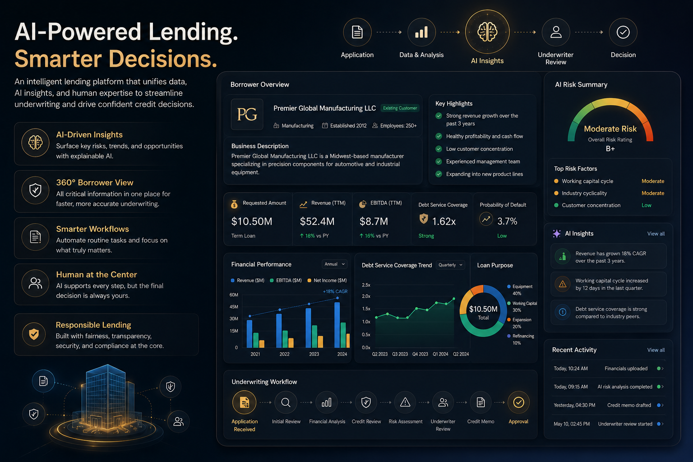

# ✦ AI Lending Platform

An AI-assisted lending experience built within an AWS ecosystem to improve underwriting workflows, strengthen risk assessment, and help lending teams make faster, more informed credit decisions while keeping human judgment at the center.

<p align="center">
  
</p>

<p align="center">
  <strong>AWS</strong> • <strong>Lending</strong> • <strong>Artificial Intelligence</strong> • <strong>Business Intelligence</strong> • <strong>Product Thinking</strong>
</p>

---

## 👋 Overview

Lending decisions require teams to evaluate large amounts of financial, operational, credit, and relationship information before making a recommendation.

This project explores how an **AWS-based lending platform** can bring borrower information, financial analysis, document intelligence, risk signals, and credit memo preparation into one unified underwriting workspace.

The platform is not designed to replace analysts, underwriters, or credit decision-makers. Its purpose is to reduce repetitive work, organize complex information, surface meaningful insights, and help lending teams make more consistent and confident decisions.

The current workflow is particularly relevant to small-business and SBA lending, but the broader product concept can support a range of lending and underwriting scenarios.

---

## 🔒 Portfolio & Confidentiality

> [!IMPORTANT]
> The interfaces, dashboards, workflows, screenshots, and visualizations shown in this repository were recreated exclusively for portfolio purposes.

The original work involved confidential lending processes, proprietary business logic, internal systems, and sensitive financial information.

To protect confidentiality:

- All borrower and customer information is fictional.
- All financial values and metrics have been recreated.
- All interface layouts are redesigned portfolio concepts.
- All business scenarios are representative rather than production examples.
- No internal reports, customer records, proprietary calculations, or confidential company information are included.
- The visuals are not screenshots of a live or production system.

The recreated designs are intended to demonstrate the analytical thinking, reporting structure, workflow design, product decisions, and user-experience principles explored during the project.

---

## 🏦 Business Context

Lending teams often need to review information from several sources before reaching a credit decision.

Depending on the loan type, this may include:

- Borrower and business information
- Financial statements
- Tax returns
- Credit reports
- Existing debt obligations
- Historical cash flow
- Debt-service coverage
- Collateral
- Guarantor information
- Ownership structure
- Industry conditions
- Loan purpose
- Relationship history
- Eligibility requirements
- Documentation completeness
- Policy exceptions

Relationship managers, analysts, processors, underwriters, and approvers may work across multiple systems while manually consolidating information and preparing credit documentation.

This project explores how analytics, AI, and AWS-based workflows could make that experience more structured, transparent, and efficient.

---

## 🎯 The Challenge

Traditional underwriting workflows may involve:

- Reviewing extensive financial documents
- Collecting information across disconnected systems
- Performing repetitive calculations
- Comparing performance across reporting periods
- Evaluating borrower repayment capacity
- Identifying missing or inconsistent information
- Reviewing collateral and guarantor support
- Checking eligibility and policy requirements
- Writing lengthy credit memorandums
- Coordinating reviews across multiple teams
- Maintaining consistency across decisions
- Documenting the reasoning behind recommendations

These activities require significant time and attention.

The opportunity is not simply to automate more work. It is to help lending professionals spend less time organizing information and more time applying judgment to the credit decision.

---

## 💡 Proposed Solution

The proposed platform combines lending workflows, analytics, AI, and cloud-based infrastructure into one modern underwriting experience.

Core capabilities may include:

- ✅ Borrower overview
- ✅ Loan request summary
- ✅ Financial statement analysis
- ✅ Cash-flow evaluation
- ✅ Debt-service coverage analysis
- ✅ Credit review
- ✅ Collateral assessment
- ✅ Guarantor review
- ✅ Eligibility and policy checks
- ✅ Document intelligence
- ✅ Risk and exception identification
- ✅ AI-assisted credit memo preparation
- ✅ Recommendation support
- ✅ Human review and approval workflows

Every recommendation remains explainable, transparent, and reviewable by qualified lending professionals.

---

## ☁️ AWS-Based Platform Environment

The broader experience is designed within an AWS ecosystem, bringing together lending workflows, reporting, analytics, document handling, and AI-assisted capabilities.

The recreated portfolio visuals do not reproduce the underlying production architecture, but the product thinking reflects a cloud-based environment where multiple capabilities can work together securely.

Representative platform components include:

- AWS-hosted lending portal
- Secure document storage
- Centralized borrower and loan information
- Workflow orchestration
- Role-based user access
- Financial and credit analysis
- AI-assisted document review
- Risk and exception monitoring
- Credit memo support
- Approval tracking
- Audit history
- Executive reporting

The objective is to create one connected experience where lending professionals spend less time navigating systems and more time evaluating the decision.

---

## 👩‍💼 My Role

My work focused on translating lending and business requirements into a clear analytical and product experience.

This included:

- Understanding underwriting workflows
- Identifying decision-relevant information
- Organizing complex borrower data into usable sections
- Defining dashboard and reporting requirements
- Designing views for analysts, underwriters, and approvers
- Identifying risk, exception, and documentation signals
- Supporting credit memo workflows
- Exploring responsible uses of AI
- Keeping human review central to the process
- Connecting business needs with product and reporting decisions
- Contributing to an AWS-based lending environment

---

## ⚙️ How the Platform Works

```text
Loan Application
        ↓
Borrower & Business Information
        ↓
Financial and Credit Analysis
        ↓
Cash-Flow, Collateral & Risk Review
        ↓
AI-Assisted Insights
        ↓
Underwriter Judgment
        ↓
Credit Memo & Recommendation
        ↓
Approval Workflow
```

The experience is designed to support the user throughout the full underwriting journey rather than treating each step as an isolated tool.

---

## 🖥️ Product Experience

### Borrower Overview

The borrower profile creates a central view of the business, loan request, ownership structure, relationship history, and key underwriting information.

A user should be able to quickly understand:

- Who the borrower is
- What the loan request is for
- How long the relationship has existed
- What information is available
- Which areas require further review
- Where risk or documentation gaps may exist

---

### Financial Analysis

The platform can consolidate financial performance into a structured analytical view.

Potential areas include:

- Revenue trends
- Profitability
- EBITDA
- Net income
- Liquidity
- Leverage
- Existing debt
- Working-capital trends
- Historical cash flow
- Projected cash flow
- Debt-service coverage
- Year-over-year changes

The purpose is not to overwhelm the user with ratios. It is to help them understand the financial story behind the loan request.

---

### Credit Review

The credit review experience may include:

- Credit history
- Existing exposure
- Payment behavior
- Delinquencies
- Outstanding obligations
- Relationship performance
- Guarantor support
- Collateral coverage
- Policy exceptions

Important information should be visible without requiring the analyst to search across several systems.

---

### Risk Assessment

The platform can bring together multiple dimensions of risk, including:

- Financial risk
- Repayment risk
- Industry risk
- Concentration risk
- Collateral risk
- Guarantor risk
- Documentation risk
- Eligibility risk
- Policy exceptions
- Data-quality concerns

Risk indicators should provide context rather than act as unexplained scores.

---

## 🤖 AI-Assisted Features

AI functions as an intelligent assistant throughout the underwriting process.

Potential capabilities include:

- Summarizing borrower information
- Extracting information from uploaded documents
- Comparing financial performance across periods
- Highlighting unusual trends
- Identifying missing documentation
- Surfacing inconsistencies between documents
- Summarizing key risks and mitigants
- Drafting sections of a credit memorandum
- Generating executive summaries
- Suggesting areas requiring further review
- Organizing supporting evidence
- Preparing information for approval discussions

AI supports the workflow, but it does not own the decision.

---

## 🧠 Product Principles

### Human judgment remains central

AI should support lending professionals, not replace their expertise, accountability, or decision-making authority.

### Explainability over novelty

An insight is only useful when the user can understand:

- What was identified
- Why it matters
- Which information supports it
- What should be reviewed next

### Clarity over information overload

The interface should prioritize:

- Meaningful signals
- Exceptions
- Trends
- Missing information
- Supporting evidence
- Recommended next steps

The goal is not to display every available field at once.

### Workflow before features

The experience should follow how lending teams actually work rather than forcing users into a technology-first process.

### Evidence before recommendation

Recommendations should be connected to financial information, documents, risk indicators, and underwriting judgment.

### Responsible use of data

Sensitive lending decisions require:

- Appropriate governance
- Data privacy
- Transparent logic
- Human oversight
- Clear ownership
- Auditability
- Careful use of borrower information

---

## 🛡️ Responsible AI Considerations

AI in lending must be used carefully because the recommendations may influence access to credit.

Important considerations include:

- Bias and fairness
- Explainability
- Data quality
- Privacy
- Security
- Auditability
- Human oversight
- Model limitations
- Appropriate escalation
- Documentation of AI-generated content
- Clear ownership of the final decision

AI should help organize complexity and surface relevant information, but final credit decisions should remain subject to qualified human review.

---

## ✨ Example User Journey

A user reviewing a loan may be able to:

1. Open the borrower profile.
2. Review the loan request and business purpose.
3. Confirm available documentation.
4. Compare financial performance across periods.
5. Review cash flow and debt-service coverage.
6. Evaluate collateral and guarantor support.
7. Identify risk indicators and policy exceptions.
8. Read AI-generated summaries and observations.
9. Add professional judgment and commentary.
10. Prepare or refine the credit memorandum.
11. Submit the recommendation for approval.
12. Track review comments and final decisions.

---

## 📈 Intended Business Value

An AI-assisted lending workflow has the potential to:

- Reduce manual underwriting effort
- Improve consistency across credit reviews
- Accelerate credit memo preparation
- Improve analyst productivity
- Reduce turnaround time
- Enhance borrower experience
- Surface risks earlier
- Improve documentation quality
- Strengthen collaboration between lending teams
- Support more traceable decisions
- Reduce repetitive document review
- Help decision-makers focus on material issues

---

## 🎨 Design Decisions

The interface was designed to feel calm and structured even when the underlying information is complex.

Key design decisions include:

- Clear visual hierarchy
- Decision-relevant KPIs
- Progressive disclosure of detail
- Consistent risk and exception indicators
- Dedicated space for human commentary
- Separation of facts, AI-generated observations, and final judgments
- Visible supporting evidence
- Simple movement between workflow stages
- Executive summaries for faster review

A lending platform should make complexity manageable without oversimplifying the decision.

---

## 🌱 Key Learnings

This project reinforced several important lessons.

### The workflow matters more than the dashboard

A polished dashboard is not enough if it does not support the way people actually evaluate and approve loans.

### AI is most useful when it reduces friction

The strongest use cases are often not fully automated decisions. They are the repetitive activities that consume time before professional judgment begins.

### Context matters

A ratio, score, or risk flag is not meaningful without borrower context, historical trends, supporting documents, and professional interpretation.

### Trust must be designed into the experience

Users are more likely to rely on AI-assisted insights when they can inspect the evidence, understand the reasoning, and retain control over the final decision.

### Cloud infrastructure should feel invisible to the user

AWS enables the broader environment, but the user experience should remain focused on clarity, workflow, and the credit decision—not on the underlying technology.

---

## 🛠️ Tools & Areas Explored

| Area | Focus |
|---|---|
| Cloud Platform | AWS |
| Analytics | Financial and credit analysis |
| Business Intelligence | Reporting and decision support |
| Artificial Intelligence | Generative AI and document intelligence concepts |
| Product Thinking | User needs, workflows, and feature design |
| Dashboard Design | Information hierarchy and visual communication |
| Workflow Design | Underwriting and approval journeys |
| Domain | Lending, credit analysis, and underwriting |
| Governance | Responsible AI and human oversight |
| Documentation | Markdown and portfolio storytelling |

---

## 📁 Repository Structure

```text
AI-Lending-Platform/
│
├── README.md
│
└── assets/
    └── hero-dashboard.png
```

Additional recreated visuals may be added later, including:

```text
assets/
├── hero-dashboard.png
├── borrower-overview.png
├── financial-analysis.png
├── risk-assessment.png
├── ai-insights.png
├── credit-memo.png
├── underwriting-workflow.png
└── system-architecture.png
```

---

## 🌐 Connect

- 🌐 [Portfolio](https://mansirathi.framer.ai/)
- 💼 [LinkedIn](https://www.linkedin.com/in/mansirathi/)
- 📂 [GitHub Profile](https://github.com/heymansirathi)

---

> Good analytics is not about showing more information.  
> It is about helping people understand what to do next.
